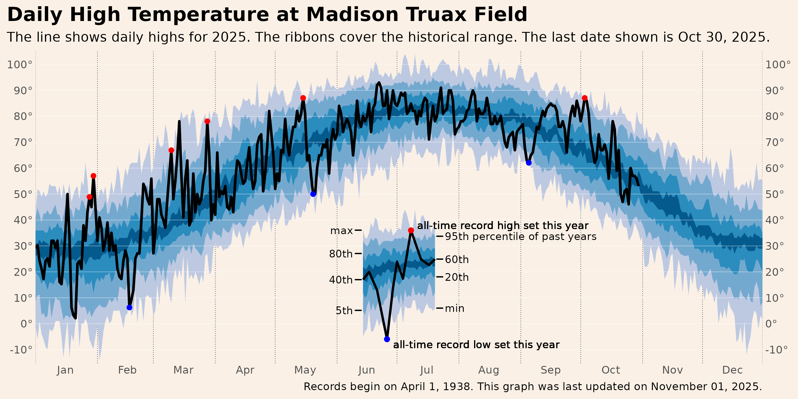
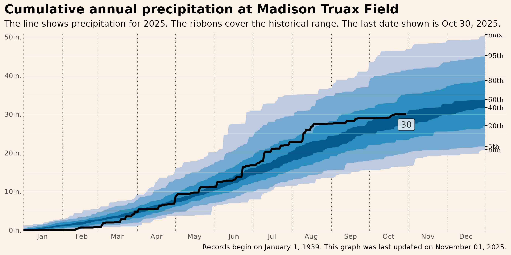

This is a fork of @jdjohn215's [Milwaukee Weather](https://github.com/jdjohn215/milwaukee-weather) repo. The code is slightly modified to better handle leap years (and of course to download data for Madison, Wisconsin.)

